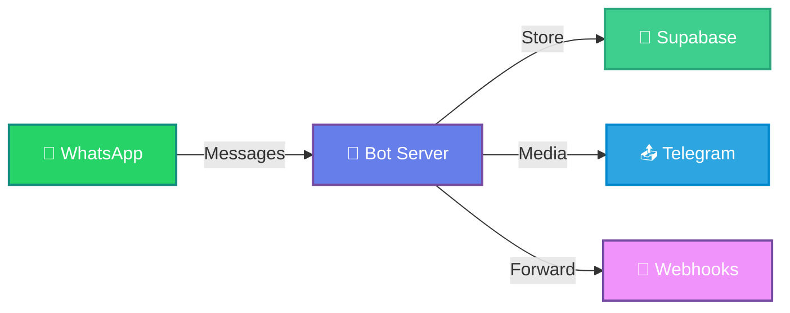

<div align="center">


<p align="center">
  
  
  
  
  
</p>

<p align="center">
  
  
  
  
</p>

### 🎯 Production-Ready WhatsApp Bot with Advanced Features

*Single-file implementation • Supabase Storage • Telegram Media • Multi-Webhook • Auto-Reconnect • Always Online*

---

</div>

## ⚡ Quick Start

<div align="center">

```bash
# 🚀 Get Started in 60 Seconds!
```

</div>

<table>
<tr>
<td width="50%">

### 📦 Installation

```bash
# Clone the repository
git clone <your-repo-url>
cd whatsappapi

# Install dependencies
npm install

# Configure environment
cp .env.example .env
```

</td>
<td width="50%">

### 🔧 Setup

```bash
# Set up Supabase database
# Run SQL from setup.sql

# Start the server
npm start

# Scan QR code
# Visit http://localhost:5000/qr
```

</td>
</tr>
</table>

<div align="center">

### 🎬 Quick Demo



</div>

---

## 📑 Table of Contents

<details open>
<summary><b>📚 Click to expand/collapse</b></summary>

- [✨ Features](#-features)
- [📋 Prerequisites](#-prerequisites)
- [🔧 Installation](#-installation)
- [🎮 Usage](#-usage)
- [🌐 API Endpoints](#-api-endpoints)
- [📤 Webhook Forwarding](#-webhook-forwarding)
- [🔄 Reconnection Strategies](#-reconnection-strategies)
- [📊 Message Types](#-message-types-supported)
- [🔒 Security](#-security)
- [📈 Monitoring](#-monitoring)
- [🧪 Testing](#-testing)
- [🐛 Troubleshooting](#-troubleshooting)
- [🚀 Deployment](#-deployment-tips)
- [📊 Database Schema](#-database-schema-summary)

</details>

---

## ✨ Features

<div align="center">

### 🎯 Core Features

</div>

<table>
<tr>
<td width="33%" align="center">

### 💾 **Storage**


✅ Session Management<br/>
✅ Message History<br/>
✅ Connection Logs<br/>
✅ No Local Files

</td>
<td width="33%" align="center">

### 📤 **Media**


✅ Unlimited Storage<br/>
✅ Fast Retrieval<br/>
✅ Cloud-Based<br/>
✅ Free Forever

</td>
<td width="33%" align="center">

### 🔔 **Webhooks**


✅ Multi-Webhook<br/>
✅ Retry Logic<br/>
✅ Async Forward<br/>
✅ Error Handling

</td>
</tr>
</table>

<div align="center">

### 🚀 Advanced Features

</div>

<table>
<tr>
<td width="25%" align="center">

🔄 **Auto-Reconnect**

Smart exponential backoff

✅ Handle all disconnect scenarios<br/>
✅ Max 10 attempts<br/>
✅ 5s-30s delays

</td>
<td width="25%" align="center">

👁️ **Always Online**

Bot appears online 24/7

✅ Presence updates<br/>
✅ Every 30 seconds<br/>
✅ Configurable

</td>
<td width="25%" align="center">

✅ **Blue Ticks**

Read receipts enabled

✅ All messages<br/>
✅ Automatic<br/>
✅ No config needed

</td>
<td width="25%" align="center">

🏓 **Self-Ping**

Prevent server sleep

✅ Free hosting<br/>
✅ Every 4 minutes<br/>
✅ Auto-detect URL

</td>
</tr>
</table>

<details>
<summary><b>🎨 Click to see ALL features</b></summary>

<br/>

| Feature | Status | Description |
|---------|--------|-------------|
| 📝 Single File | ✅ | All code in `wa-api.js` |
| 💾 Supabase Storage | ✅ | No local session files |
| 📤 Telegram Media | ✅ | Unlimited free storage |
| 🔔 Multi-Webhook | ✅ | Forward to multiple URLs |
| 🖼️ Media Handling | ✅ | Images, videos, docs, audio, stickers |
| 🔄 Auto-Reconnect | ✅ | Smart exponential backoff |
| 📱 QR Webpage | ✅ | Auto-refresh QR code |
| 🔐 Protected API | ✅ | Rate limiting & auth |
| 💬 Message Logging | ✅ | Complete history in DB |
| 😊 Reactions | ✅ | Store and forward |
| 💭 Replies | ✅ | Context detection |
| 🏓 Self-Ping | ✅ | Prevent sleep on free hosting |
| 👁️ Always Online | ✅ | Bot appears online 24/7 |
| ✅ Blue Ticks | ✅ | Read receipts for all |
| 📤 Store Outgoing | ✅ | Save messages you send |
| 📥 Forward Incoming | ✅ | No message skips |

</details>

---

## 📋 Prerequisites

<div align="center">

| Requirement | Version/Details | Where to Get |
|-------------|-----------------|--------------|
|  | 18+ | [nodejs.org](https://nodejs.org) |
|  | Account + Project | [supabase.com](https://supabase.com) |
|  | Phone Number | Your phone |
|  | Bot Token | [@BotFather](https://t.me/botfather) |
|  | Chat ID | [@userinfobot](https://t.me/userinfobot) |

</div>

---

## 🔧 Installation

<div align="center">

### 📥 Step-by-Step Setup

</div>

<table>
<tr>
<td width="33%" align="center">

#### 1️⃣ Clone

```bash
git clone <repo-url>
cd whatsappapi
```

</td>
<td width="33%" align="center">

#### 2️⃣ Install

```bash
npm install
```

</td>
<td width="33%" align="center">

#### 3️⃣ Configure

```bash
cp .env.example .env
# Edit .env
```

</td>
</tr>
</table>

### 3. Set up Supabase database

<details>
<summary><b>📊 Click to see SQL Schema</b></summary>

```sql
-- Auth Data table (stores WhatsApp authentication state)
CREATE TABLE IF NOT EXISTS public.auth_data (
  session_id TEXT NOT NULL,
  file_name TEXT NOT NULL,
  file_data TEXT NOT NULL,
  updated_at TIMESTAMP WITHOUT TIME ZONE DEFAULT NOW(),
  CONSTRAINT auth_data_pkey PRIMARY KEY (session_id, file_name)
) TABLESPACE pg_default;

CREATE INDEX IF NOT EXISTS idx_auth_data_session 
ON public.auth_data USING BTREE (session_id) TABLESPACE pg_default;

-- Messages table (stores all incoming and outgoing messages)
CREATE TABLE IF NOT EXISTS public.messages (
  id BIGSERIAL NOT NULL,
  message_id TEXT,
  jid TEXT,
  from_plain_phone TEXT,
  display_name TEXT,
  type TEXT,
  text TEXT,
  media_mimetype TEXT,
  media_filename TEXT,
  media_size BIGINT,
  reaction_text TEXT,
  is_reply BOOLEAN DEFAULT FALSE,
  reply_to_message_id TEXT,
  reply_to_text TEXT,
  chat_type TEXT,
  from_me BOOLEAN DEFAULT FALSE,
  received_at TIMESTAMP WITHOUT TIME ZONE,
  created_at TIMESTAMP WITHOUT TIME ZONE DEFAULT NOW(),
  raw JSONB,
  direction TEXT,
  media_unique_id TEXT,
  telegram_message_id TEXT,
  telegram_file_id TEXT,
  CONSTRAINT messages_pkey PRIMARY KEY (id),
  CONSTRAINT unique_media_id UNIQUE (media_unique_id)
) TABLESPACE pg_default;

-- Indexes for better query performance
CREATE INDEX IF NOT EXISTS idx_messages_jid 
ON public.messages USING BTREE (jid) TABLESPACE pg_default;

CREATE INDEX IF NOT EXISTS idx_messages_message_id 
ON public.messages USING BTREE (message_id) TABLESPACE pg_default;

CREATE INDEX IF NOT EXISTS idx_messages_direction 
ON public.messages USING BTREE (direction) TABLESPACE pg_default;

CREATE INDEX IF NOT EXISTS idx_messages_created_at 
ON public.messages USING BTREE (created_at DESC) TABLESPACE pg_default;

CREATE INDEX IF NOT EXISTS idx_messages_from_plain_phone 
ON public.messages USING BTREE (from_plain_phone) TABLESPACE pg_default;

CREATE INDEX IF NOT EXISTS idx_messages_type 
ON public.messages USING BTREE (type) TABLESPACE pg_default;

CREATE INDEX IF NOT EXISTS idx_messages_media_unique_id 
ON public.messages USING BTREE (media_unique_id) TABLESPACE pg_default;

-- Connection logs table (monitors connection events)
CREATE TABLE IF NOT EXISTS public.connection_logs (
  id BIGSERIAL NOT NULL,
  event_type TEXT,
  status_code INTEGER,
  reason TEXT,
  attempt_number INTEGER,
  timestamp TIMESTAMP WITHOUT TIME ZONE DEFAULT NOW(),
  CONSTRAINT connection_logs_pkey PRIMARY KEY (id)
) TABLESPACE pg_default;

CREATE INDEX IF NOT EXISTS idx_connection_logs_timestamp 
ON public.connection_logs USING BTREE (timestamp DESC) TABLESPACE pg_default;

CREATE INDEX IF NOT EXISTS idx_connection_logs_event_type 
ON public.connection_logs USING BTREE (event_type) TABLESPACE pg_default;
```

</details>

### 4. Configure environment variables

<details>
<summary><b>🔐 Click to see Environment Variables</b></summary>

```env
# Supabase Configuration
SUPABASE_URL=https://your-project.supabase.co
SUPABASE_KEY=your-service-role-key

# API Security
AUTH_KEY=your-secret-api-key

# Telegram Configuration (for media storage)
TELEGRAM_BOT_TOKEN=your-bot-token-from-botfather
TELEGRAM_CHAT_ID=your-telegram-chat-id

# Webhook Configuration
N8N_WEBHOOKS=https://webhook1.com,https://webhook2.com

# Server Configuration
PORT=5000
QR_POLL_INTERVAL_MS=3000
MAX_MEDIA_SIZE=52428800

# Self-Ping Configuration (prevents server sleep on free hosting)
SELF_PING_ENABLED=true
SELF_PING_INTERVAL_MS=240000
SELF_PING_URL=https://your-app.onrender.com/health

# Session Configuration (optional)
SESSION_ID=default

# Presence Configuration (optional)
PRESENCE_UPDATE_INTERVAL_MS=30000
```

**Required Variables:**
- ✅ `SUPABASE_URL` - Your Supabase project URL
- ✅ `SUPABASE_KEY` - Your Supabase service role key
- ✅ `AUTH_KEY` - Secure random string (generate: `openssl rand -hex 32`)
- ✅ `TELEGRAM_BOT_TOKEN` - Create via [@BotFather](https://t.me/botfather)
- ✅ `TELEGRAM_CHAT_ID` - Get from [@userinfobot](https://t.me/userinfobot)

</details>

---

## 🎮 Usage

### 🚀 Start the server

<table>
<tr>
<td width="50%">

**Production Mode**
```bash
npm start
```

</td>
<td width="50%">

**Development Mode**
```bash
npm install -g nodemon
nodemon wa-api.js
```

</td>
</tr>
</table>

### 📱 Scan QR code

<div align="center">

1. Visit `http://localhost:5000/qr`
2. Scan the QR code with WhatsApp mobile app
3. Page will automatically update when connected


</div>

---

## 🌐 API Endpoints

<div align="center">

### 🔌 Available Endpoints

</div>

<details>
<summary><b>1️⃣ Health Check - GET /health</b></summary>

```bash
GET /health
```

**Response:**
```json
{
  "status": "ok",
  "connected": true,
  "last_qr": "2024-01-15T10:30:00.000Z",
  "uptime": 3600,
  "reconnect_attempts": 0,
  "last_connection": "2024-01-15T10:30:00.000Z",
  "telegram_configured": true,
  "self_ping_enabled": true,
  "presence_updates_active": true,
  "user": {
    "id": "919876543210",
    "name": "John Doe"
  }
}
```

</details>

<details>
<summary><b>2️⃣ Send Message - POST /send</b></summary>

```bash
POST /send
Headers:
  auth-key: your-secret-api-key
  Content-Type: application/json
```

**Send Text:**
```json
{
  "jid": "919876543210@s.whatsapp.net",
  "message": "Hello from API!"
}
```

**Send with Image:**
```json
{
  "jid": "919876543210@s.whatsapp.net",
  "message": "Check this out!",
  "file": "<base64-encoded-image>",
  "filename": "photo.jpg",
  "mimetype": "image/jpeg"
}
```

**Response:**
```json
{
  "ok": true,
  "message_id": "3EB0ABC123DEF456",
  "raw": { ... }
}
```

</details>

<details>
<summary><b>3️⃣ Get Media File - GET /media/:uniqueId</b></summary>

```bash
GET /media/MEDIA_1234567890_abcdef123456
Headers:
  auth-key: your-secret-api-key
```

**Response:**
- ✅ Success: Binary file data with appropriate Content-Type header
- ❌ Error: `{ "success": false, "error": "Media not found" }`

**How it works:**
1. Media received → uploaded to Telegram
2. `media_unique_id` & `telegram_file_id` stored in database
3. Retrieve original file from Telegram via this endpoint

</details>

<details>
<summary><b>4️⃣ Webhook Test - POST /webhook-test</b></summary>

```bash
POST /webhook-test
Headers:
  auth-key: your-secret-api-key
  Content-Type: application/json
```

```json
{
  "message_id": "test123",
  "jid": "919876543210@s.whatsapp.net",
  "phone_no": "919876543210",
  "display_name": "Test User",
  "type": "conversation",
  "text": "Test message",
  "from_me": false,
  "received_at": "2024-01-15T10:30:00.000Z"
}
```

</details>

<details>
<summary><b>5️⃣ Clear Session - POST /clear-session</b></summary>

```bash
POST /clear-session
Headers:
  auth-key: your-secret-api-key
```

Force logout and generate new QR code.

</details>

---

## 📤 Webhook Forwarding

<div align="center">

### 🔔 Automatic Message Forwarding

</div>

All **incoming messages** are forwarded to configured webhooks:

```json
{
  "message_id": "3EB0ABC123",
  "jid": "919876543210@s.whatsapp.net",
  "phone_no": "919876543210",
  "display_name": "John Doe",
  "type": "imageMessage",
  "text": "My new car!",
  "media_unique_id": "MEDIA_1234567890_abcdef123456",
  "telegram_message_id": "12345",
  "telegram_file_id": "AgACAgIAAxkBAAIBCD...",
  "media_mimetype": "image/jpeg",
  "media_filename": "IMG-20240115-WA0001.jpg",
  "media_size": 245760,
  "from_me": false,
  "received_at": "2024-01-15T14:30:45.000Z",
  "is_reply": false,
  "reply_to_message_id": null,
  "reply_to_text": null,
  "reaction_text": null
}
```

> **📝 Important Notes:**
> - ✅ Media files are **NOT** sent as base64 (stored in Telegram)
> - ✅ Use `media_unique_id` to retrieve via `/media/:uniqueId`
> - ❌ Outgoing messages (sent by you) are **NOT** forwarded
> - ✅ Only incoming messages are forwarded

### 🔄 Retry Logic

<div align="center">

| Attempt | Delay | Action |
|---------|-------|--------|
| 1st | 0s | Initial send |
| 2nd | 2s | First retry |
| 3rd | 5s | Second retry |
| 4th | 10s | Final retry |

</div>

---

## 🔄 Reconnection Strategies

<div align="center">

### 🔌 Automatic Reconnection System

</div>

<table>
<tr>
<th>Reason</th>
<th>Strategy</th>
<th>Action</th>
</tr>
<tr>
<td>🔴 <code>loggedOut</code></td>
<td>Clear & Restart</td>
<td>Generate new QR code</td>
</tr>
<tr>
<td>⚠️ <code>badSession</code></td>
<td>Clear & Restart</td>
<td>Remove corrupted session</td>
</tr>
<tr>
<td>🔌 <code>connectionClosed</code></td>
<td>Exponential Backoff</td>
<td>Auto-reconnect with delays</td>
</tr>
<tr>
<td>📡 <code>connectionLost</code></td>
<td>Exponential Backoff</td>
<td>Auto-reconnect with delays</td>
</tr>
<tr>
<td>⏱️ <code>timedOut</code></td>
<td>Exponential Backoff</td>
<td>Auto-reconnect with delays</td>
</tr>
<tr>
<td>🔄 <code>restartRequired</code></td>
<td>Immediate</td>
<td>Restart immediately</td>
</tr>
</table>

**Backoff Pattern:**  
`5s → 10s → 15s → 20s → 25s → 30s (max)`

**Max Attempts:** 10 before manual intervention required

---

## 📊 Message Types Supported

<div align="center">

| Type | Icon | Status | Details |
|------|------|--------|---------|
| Text | 💬 | ✅ | `conversation`, `extendedTextMessage` |
| Images | 🖼️ | ✅ | `imageMessage` |
| Videos | 🎥 | ✅ | `videoMessage` |
| Audio | 🎵 | ✅ | `audioMessage` |
| Documents | 📄 | ✅ | `documentMessage` |
| Stickers | 😊 | ✅ | `stickerMessage` |
| Reactions | ❤️ | ✅ | `reactionMessage` |
| Replies | 💭 | ✅ | Context detection |

</div>

---

## 🔒 Security

<div align="center">

### 🛡️ Security Features

</div>

| Feature | Implementation | Details |
|---------|----------------|---------|
| 🚦 Rate Limiting | 10 req/min | Per IP on `/send` endpoint |
| 🔐 Authentication | Header Required | `auth-key` for all protected endpoints |
| ✅ Input Validation | Strict | JID format, file size (50MB max) |
| 🔒 Credential Protection | Environment Vars | No hardcoded secrets |
| 📤 Telegram Storage | Secure | Media in Telegram, not Supabase |
| 🆔 Unique Media IDs | Prevents Duplicates | Crypto-generated identifiers |

---

## 📈 Monitoring

<div align="center">

### 📊 Database Queries for Monitoring

</div>

<details>
<summary><b>📋 Connection Logs</b></summary>

```sql
SELECT * FROM connection_logs 
ORDER BY timestamp DESC 
LIMIT 10;
```

</details>

<details>
<summary><b>💬 Recent Messages with Media Info</b></summary>

```sql
SELECT 
  display_name, 
  type, 
  text, 
  direction,
  from_me,
  media_unique_id,
  telegram_file_id,
  created_at 
FROM messages 
ORDER BY created_at DESC 
LIMIT 50;
```

</details>

<details>
<summary><b>📎 Media Messages Only</b></summary>

```sql
SELECT 
  display_name,
  media_filename,
  media_mimetype,
  media_size,
  media_unique_id,
  telegram_message_id,
  created_at
FROM messages
WHERE media_unique_id IS NOT NULL
ORDER BY created_at DESC;
```

</details>

<details>
<summary><b>🔐 Session Files</b></summary>

```sql
SELECT 
  session_id,
  file_name,
  updated_at
FROM auth_data
ORDER BY updated_at DESC;
```

</details>

---

## 🧪 Testing

<div align="center">

### ✅ Manual Acceptance Tests

</div>

<details>
<summary><b>1️⃣ QR Code Flow</b></summary>

- [ ] Start server with clean Supabase (no `auth_data`)
- [ ] Visit `/qr` and verify QR PNG displays
- [ ] Scan with WhatsApp and confirm connection
- [ ] Verify page switches to "Connected" state
- [ ] Check `auth_data` table for session files

</details>

<details>
<summary><b>2️⃣ Incoming Messages</b></summary>

- [ ] Send text message to bot
- [ ] Verify in `messages` table (`from_me=false`, `direction='inbound'`)
- [ ] Verify webhook received payload
- [ ] Send image with caption
- [ ] Verify media uploaded to Telegram
- [ ] Check `media_unique_id`, `telegram_message_id`, `telegram_file_id`
- [ ] Retrieve media via `/media/:uniqueId`

</details>

<details>
<summary><b>3️⃣ Outgoing Messages</b></summary>

- [ ] Call `/send` with text
- [ ] Verify message delivered on WhatsApp
- [ ] Verify in database (`from_me=true`, `direction='outbound'`)
- [ ] Verify webhook does NOT receive this message
- [ ] Send image via `/send`
- [ ] Verify image sent and stored

</details>

<details>
<summary><b>4️⃣ Reconnection</b></summary>

- [ ] Simulate network drop
- [ ] Verify automatic reconnection with backoff
- [ ] Call `/clear-session`
- [ ] Verify `auth_data` cleared
- [ ] Verify new QR generated

</details>

<details>
<summary><b>5️⃣ Telegram Media Storage</b></summary>

- [ ] Send image/video to bot
- [ ] Check Telegram bot chat for uploaded media
- [ ] Verify caption contains metadata
- [ ] Retrieve via `/media/:uniqueId`
- [ ] Verify media matches original

</details>

<details>
<summary><b>6️⃣ Self-Ping & Presence</b></summary>

- [ ] Check logs for "🏓 PING" every 4 minutes
- [ ] Verify bot appears "online" in WhatsApp
- [ ] Check logs for "👁️ PRESENCE" every 30 seconds

</details>

---

## 🐛 Troubleshooting

<div align="center">

### 🔍 Common Issues & Solutions

</div>

<details>
<summary><b>❌ QR not showing</b></summary>

**Solution:**
- Check console logs
- Verify Supabase credentials
- Ensure `auth_data` table exists
- Clear browser cache

</details>

<details>
<summary><b>❌ Messages not forwarding</b></summary>

**Solution:**
- Verify `N8N_WEBHOOKS` in `.env`
- Check webhook endpoint logs
- Test with `/webhook-test` endpoint
- Check firewall/network settings

</details>

<details>
<summary><b>❌ Bot not connected error</b></summary>

**Solution:**
- Visit `/health` to check status
- Rescan QR if needed
- Check internet connection
- Restart server

</details>

<details>
<summary><b>❌ Session keeps logging out</b></summary>

**Solution:**
- Clear session via `/clear-session`
- Ensure stable internet
- Check `auth_data` table integrity
- Verify Supabase connection

</details>

<details>
<summary><b>❌ Media not uploading to Telegram</b></summary>

**Solution:**
- Verify `TELEGRAM_BOT_TOKEN` correct
- Verify `TELEGRAM_CHAT_ID` correct
- Check bot not blocked
- Ensure bot can send to chat

</details>

<details>
<summary><b>❌ Self-ping not working</b></summary>

**Solution:**
- Set `SELF_PING_ENABLED=true`
- Verify `SELF_PING_URL` accessible
- Check logs for ping errors
- Test URL manually

</details>

<details>
<summary><b>❌ Bot not showing online</b></summary>

**Solution:**
- Check logs for presence updates
- Verify connection stable
- Restart server
- Check `PRESENCE_UPDATE_INTERVAL_MS`

</details>

<details>
<summary><b>❌ Media retrieval fails</b></summary>

**Solution:**
- Check `telegram_file_id` in database
- Verify Telegram bot token valid
- Ensure media not deleted from Telegram
- Check file size limits

</details>

---

## 🎯 Key Differences from Standard Setup

<div align="center">

### 💡 What Makes This Special

</div>

<table>
<tr>
<th>Feature</th>
<th>Standard Setup</th>
<th>This Project ⭐</th>
</tr>
<tr>
<td><b>Media Storage</b></td>
<td>Base64 in Supabase<br/>💾 Large DB<br/>🐌 Slow queries</td>
<td>Telegram Bot<br/>☁️ Unlimited<br/>⚡ Fast & Free</td>
</tr>
<tr>
<td><b>Session Management</b></td>
<td><code>sessions</code> table with JSONB</td>
<td><code>auth_data</code> table<br/>📁 Individual files<br/>🔒 More reliable</td>
</tr>
<tr>
<td><b>Message Tracking</b></td>
<td>Only incoming messages</td>
<td>Both incoming & outgoing<br/>📊 Complete history</td>
</tr>
<tr>
<td><b>Webhook Behavior</b></td>
<td>All messages forwarded</td>
<td>Only incoming<br/>🚫 Prevents loops</td>
</tr>
<tr>
<td><b>Uptime Management</b></td>
<td>Manual monitoring</td>
<td>Self-ping mechanism<br/>🏓 Free hosting friendly</td>
</tr>
<tr>
<td><b>Online Presence</b></td>
<td>Default behavior</td>
<td>Always online updates<br/>👁️ 24/7 visibility</td>
</tr>
<tr>
<td><b>Read Receipts</b></td>
<td>Optional</td>
<td>Always enabled<br/>✅ Blue ticks for all</td>
</tr>
</table>

---

## 🚀 Deployment Tips

<div align="center">

### 🌐 Deploy to Popular Platforms

</div>

<details>
<summary><b>🟢 Render.com</b></summary>

1. Set `SELF_PING_ENABLED=true`
2. Set `SELF_PING_URL=https://your-app.onrender.com/health`
3. Free tier sleeps after 15 min - self-ping keeps alive
4. Auto-deploy from GitHub
5. Environment variables in dashboard

</details>

<details>
<summary><b>🚂 Railway.app</b></summary>

1. Same as Render
2. Set `PORT` env (Railway auto-provides)
3. Fast deployments
4. Built-in metrics

</details>

<details>
<summary><b>🟣 Heroku</b></summary>

1. Enable self-ping
2. Use hobby dyno (free deprecated)
3. Add Procfile: `web: node wa-api.js`
4. Set environment variables

</details>

<details>
<summary><b>🖥️ VPS (DigitalOcean, AWS, etc.)</b></summary>

1. Can disable self-ping: `SELF_PING_ENABLED=false`
2. Set up PM2:

```bash
npm install -g pm2
pm2 start wa-api.js --name whatsapp-api
pm2 startup
pm2 save
pm2 logs whatsapp-api
```

3. Use nginx as reverse proxy
4. Set up SSL with Let's Encrypt

</details>

---

## 📊 Database Schema Summary

<div align="center">

### 🗄️ Tables Overview

</div>

<table>
<tr>
<td width="33%" align="center">

### 🔐 `auth_data`

WhatsApp session files

**Columns:**
- `session_id`
- `file_name`
- `file_data`
- `updated_at`

**Purpose:**
Stores authentication state<br/>
No local files needed

</td>
<td width="33%" align="center">

### 💬 `messages`

All messages (in & out)

**Key Columns:**
- `media_unique_id`
- `telegram_file_id`
- `from_me`
- `direction`

**Purpose:**
Complete message history<br/>
Media references

</td>
<td width="33%" align="center">

### 📊 `connection_logs`

Connection events

**Columns:**
- `event_type`
- `status_code`
- `reason`
- `timestamp`

**Purpose:**
Debugging reconnections<br/>
Monitor stability

</td>
</tr>
</table>

---

## 🎨 Features Summary

<div align="center">

### ✅ What This Bot Does

</div>

<table>
<tr>
<td width="50%">

**Receives & Stores:**
- ✅ ALL incoming messages
- ✅ Text, media, reactions, replies
- ✅ Media uploaded to Telegram
- ✅ Complete metadata tracking

</td>
<td width="50%">

**Sends & Forwards:**
- ✅ ALL outgoing messages stored
- ✅ Forwards incoming to webhooks
- ✅ NOT outgoing (prevents loops)
- ✅ Blue ticks (read receipts)

</td>
</tr>
<tr>
<td width="50%">

**Always Active:**
- ✅ Appears online 24/7
- ✅ Self-ping (no sleep)
- ✅ Auto-reconnect (smart backoff)
- ✅ Web-based QR scanning

</td>
<td width="50%">

**Cloud Storage:**
- ✅ No local files
- ✅ Supabase for data
- ✅ Telegram for media
- ✅ Environment variables

</td>
</tr>
</table>

<div align="center">

### ❌ What This Bot Does NOT Do

</div>

| Does NOT | Reason |
|----------|--------|
| ❌ Forward outgoing messages to webhooks | Prevents loops |
| ❌ Store media in Supabase | Uses Telegram (unlimited) |
| ❌ Require local file storage | Everything in cloud |
| ❌ Expose credentials | All in `.env` |

---

## 📞 Getting Help

<div align="center">

### 🆘 Debug Checklist

</div>

- [ ] 1. Check `/health` endpoint - is bot connected?
- [ ] 2. View console logs - colorful emojified output
- [ ] 3. Check Supabase tables - are messages stored?
- [ ] 4. Verify Telegram - are media files uploading?
- [ ] 5. Test webhooks - are they receiving payloads?

### 📋 Common Log Messages

<div align="center">

| Icon | Message | Meaning |
|------|---------|---------|
| 🚀 | `CONNECT` | Bot connected successfully |
| 🔌 | `DISCONN` | Bot disconnected (auto-reconnect) |
| 💬 | `MESSAGE` | Message received/sent |
| 📤 | `TELEGRAM` | Media uploaded to Telegram |
| 🔔 | `WEBHOOK` | Message forwarded to webhook |
| 💾 | `DATABASE` | Data saved to Supabase |
| 🏓 | `PING` | Self-ping executed |
| 👁️ | `PRESENCE` | Online status updated |

</div>

---

## 🏗️ Architecture Overview

```
┌─────────────────────────────────────────────────────────────┐
│                     WhatsApp API Server                      │
│                        (wa-api.js)                          │
└────────┬────────────────────────────────────────────┬───────┘
         │                                             │
         ▼                                             ▼
┌────────────────┐                            ┌────────────────┐
│   WhatsApp     │◄───── Baileys ──────────►│    Express     │
│   Connection   │      (WebSocket)          │   Web Server   │
└────────┬───────┘                           └────────┬───────┘
         │                                            │
         │                                            │
         ▼                                            ▼
┌────────────────────────────────────────────────────────────┐
│                    Storage Layer                           │
├───────────────────┬──────────────────┬─────────────────────┤
│   Supabase DB     │   Telegram Bot   │   N8N Webhooks     │
│   - auth_data     │   - Media Files  │   - Forward Msgs   │
│   - messages      │   - Unlimited    │   - Retry Logic    │
│   - conn_logs     │   - Free Storage │   - Async          │
└───────────────────┴──────────────────┴─────────────────────┘
```

### 📊 Data Flow

**Incoming Message:**
1. WhatsApp → Baileys → Message Handler
2. If media: Download → Upload to Telegram → Get file_id
3. Save to Supabase (messages table) with telegram_file_id
4. Forward to N8N webhooks (async)
5. Send blue tick (read receipt)

**Outgoing Message:**
1. POST /send → Validate → Send via Baileys
2. Save to Supabase (from_me=true, direction=outbound)
3. NOT forwarded to webhooks

**Media Retrieval:**
1. GET /media/:uniqueId
2. Query Supabase for telegram_file_id
3. Download from Telegram
4. Stream to client

---

<div align="center">

## 📜 License

MIT License - feel free to use and modify!

---

## 🤝 Support

<table>
<tr>
<td align="center" width="33%">

### 📚 Documentation
Check this README first<br/>
All features documented

</td>
<td align="center" width="33%">

### 🐛 Issues
Found a bug?<br/>
Open an issue on GitHub

</td>
<td align="center" width="33%">

### 💡 Improvements
Have an idea?<br/>
PRs welcome!

</td>
</tr>
</table>

---

<div align="center">

### ⭐ If you found this helpful, give it a star!


<p align="center">
  
  
  
  
  
</p>

</div>

</div>
